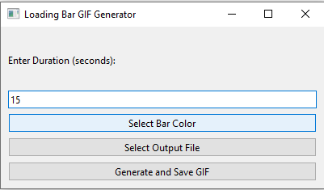

# Loading Bar GIF Generator

Loading Bar GIF Generator is a PySide6-based application that allows you to create an animated loading bar with a transparent background and save it as a GIF. You can specify the duration of the animation, select the color of the loading bar, and choose the output file location.

## Features

- Input the duration of the loading bar animation in seconds.
- Select the color of the loading bar.
- Choose the output file location.
- Generate and save the loading bar animation as a GIF with a transparent background. 

## Requirements

- Python 3.x
- PySide6
- Pillow
- imageio

## Installation

1. Download the executable file from the [Releases](https://github.com/nakhani/bar-loading-gif-generator/releases) section.
2. Run the executable file `loading_bar_generator.exe`.

## Usage

1. Run the application:
   ```bash
   python loading_bar_generator.py
   ```
2. The application window will open.

3. Follow the steps below to create the loading bar GIF:

    - Enter the duration of the loading bar animation in seconds.

    - Click the "Select Bar Color" button to choose the color of the loading bar.

    - Click the "Select Output File" button to specify the output file location.

    - Click the "Generate and Save GIF" button to create and save the loading bar animation as a GIF.

4. A message box will inform you when the GIF has been successfully generated.

## Example

Here's an example of how the application window looks:

   


## Download the Executable
You can download the executable file from the [Releases](https://github.com/nakhani/bar-loading-gif-generator/releases) section.


## Acknowledgments

- [PySide6](https://pypi.org/project/PySide6/) - Python bindings for the Qt libraries.
- [Pillow](https://pypi.org/project/Pillow/) - Python Imaging Library (PIL Fork).
- [imageio](https://pypi.org/project/imageio/) - Library for reading and writing image data.